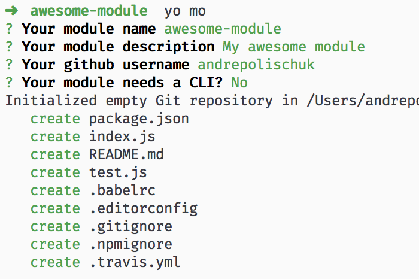

# generator-mo [![Build Status][travis-image]][travis-url]

> Yeoman generator for ES2015 node and browser modules

* ES2015
* Testing with [AVA][ava]
* Ready to use with [Travis CI][travis]
* Airbnb [style guide][airbnb] with [eslint][eslint]
* With CLI support



## Install

```sh
npm install --global generator-mo
```

## Usage

With [yo][yo]:

```sh
yo mo
```

## License

MIT

[travis-url]: https://travis-ci.org/andrepolischuk/generator-mo
[travis-image]: https://travis-ci.org/andrepolischuk/generator-mo.svg?branch=master

[ava]: https://github.com/sindresorhus/ava
[travis]: https://travis-ci.org
[eslint]: https://github.com/eslint/eslint
[airbnb]: https://github.com/airbnb/javascript
[yo]: https://github.com/yeoman/yo
